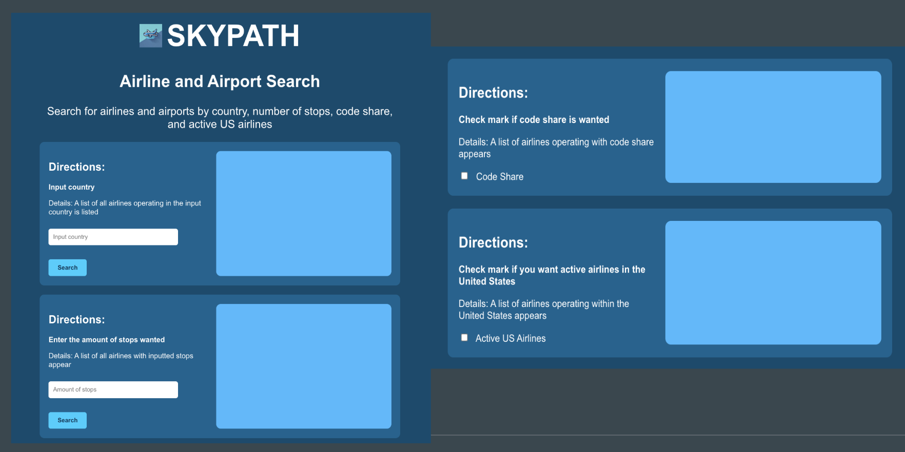
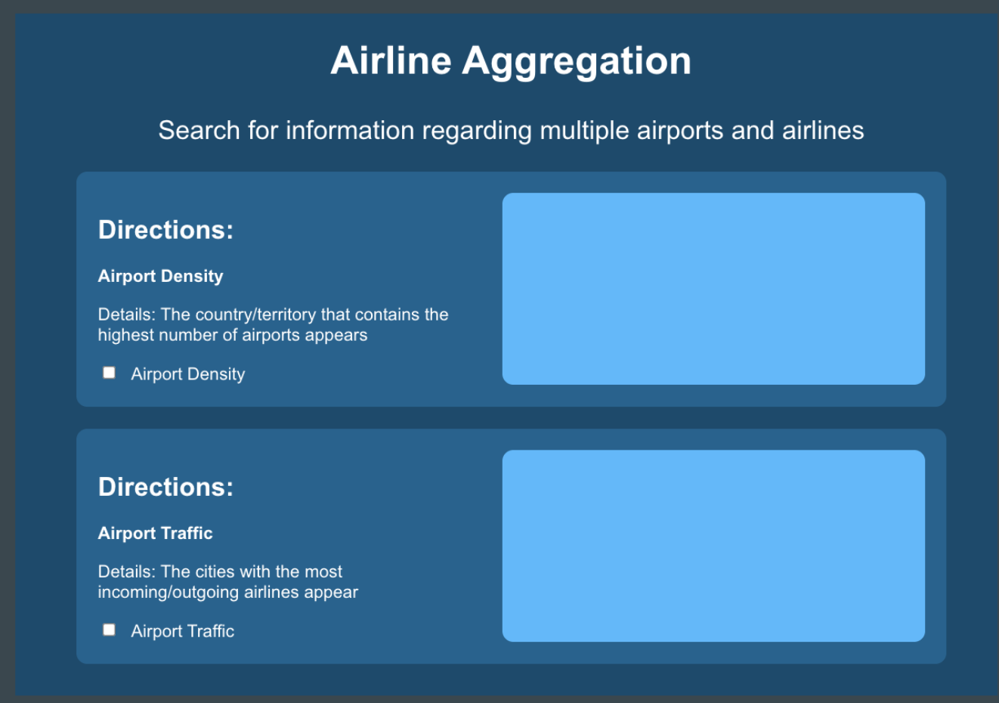
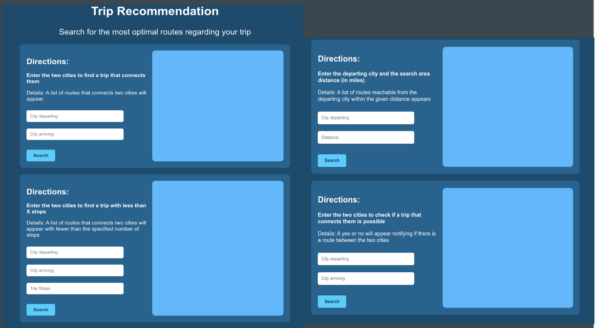

# ✈️ SkyPath – Airline Search Engine (CS 431 Big Data Project)

Welcome to **SkyPath**, a full-stack airline search engine developed by Biniam Gashaw, Angelo Calingo, and Sutter Reynolds for the CS 431 Big Data course at the University of Nevada, Reno.

Instead of just building a flight booking system, SkyPath is designed to help users **explore**, **analyze**, and **interact** with global airline data from OpenFlights.org using modern big data tools and cloud deployment.

---

## 🔍 What You Can Do with SkyPath

### ✈️ Airline & Airport Search
1. Find a list of airports operating in any country (e.g., "India").
2. Find the list of airlines having a specific number of stops (e.g., 2 stops).
3. View all airlines operating with code-share agreements.
4. View all active airlines currently operating in the United States.



---

### 📊 Airline Aggregation
5. Identify the country or territory with the **highest number of airports**.
6. View the **top k cities** with the most incoming and outgoing airlines.



---

### 🧭 Trip Recommendation Engine
7. Find a trip (multi-hop path) connecting two cities X and Y.
8. Find a trip between cities X and Y with fewer than Z stops.
9. Find all cities reachable within **D hops** from a given city.



---

## 🛠️ Technologies Used

### Backend
- **Python + Flask** – RESTful API
- **MySQL** – Relational database for cleaned OpenFlights data
- **Apache Spark + GraphFrames** – Trip path recommendation engine
- **AWS Glue** – ETL for cleaning and transforming raw OpenFlights data

### Frontend
- **React.js + Tailwind CSS** – Responsive and interactive UI
- **Fetch API + React Hooks** – Frontend/backend integration
- **Postman** – Testing REST APIs

### Deployment
- **AWS EC2** – Hosted the full-stack app (frontend + backend)
- **NGINX** – Served static files and proxied API traffic
- **AWS S3, IAM, CloudWatch** – Data storage, access management, and debugging

---

## 🏃 How to Run SkyPath Locally

> ⚠️ Prerequisites:
> - Python 3.8+, Node.js + npm
> - MySQL and Apache Spark installed
> - Java 8+ and `mysql-connector-j-9.3.0.jar` in `Backend/lib/`

---

### 🔧 Backend Setup (Flask + MySQL)

```bash
cd Backend/
python3 -m venv venv
source venv/bin/activate
pip install -r requirements.txt
```

#### Create a `.env` file in `Backend/`:
```env
DB_HOST=airlines-search-engine-db.chg68wcwe6cs.us-west-1.rds.amazonaws.com
DB_NAME=airDB
DB_USER=adminUser
DB_PASSWORD=BigData!
DB_PORT=3306

JDBC_USER=SkyPath
JDBC_PASSWORD=BigData!
MYSQL_JAR_PATH=lib/mysql-connector-j-9.3.0.jar
```

Ensure the JAR file exists at: `Backend/lib/mysql-connector-j-9.3.0.jar`

Start the Flask backend:
```bash
python3 app.py
```

---

### 💻 Frontend Setup (React)

```bash
cd skypath-ui/
npm install
npm start
```

Your browser will open `http://localhost:3000` and connect to the backend on `http://localhost:5000`.

---

## ✅ Ready to Explore

SkyPath makes exploring airline networks easier and more transparent with structured queries and an intuitive UI. This project showcases data engineering, full-stack dev, and cloud deployment—bringing it all together in one app.

---
